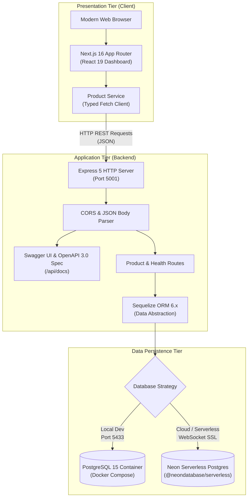
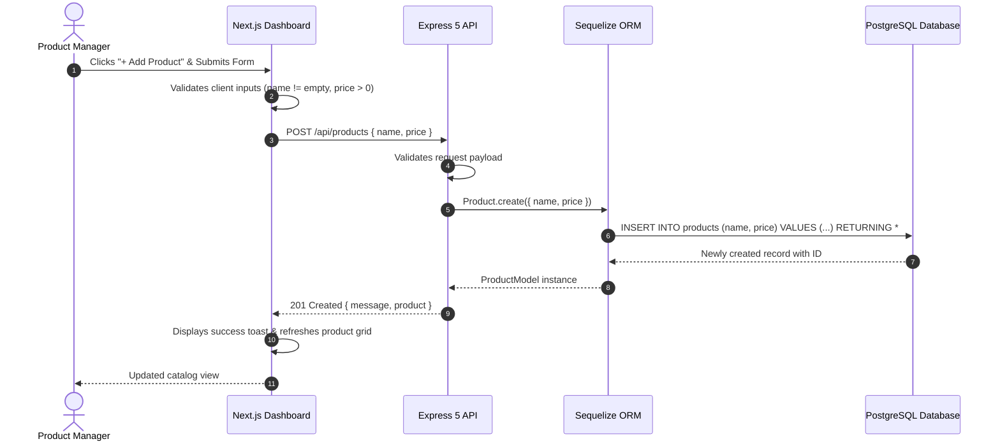
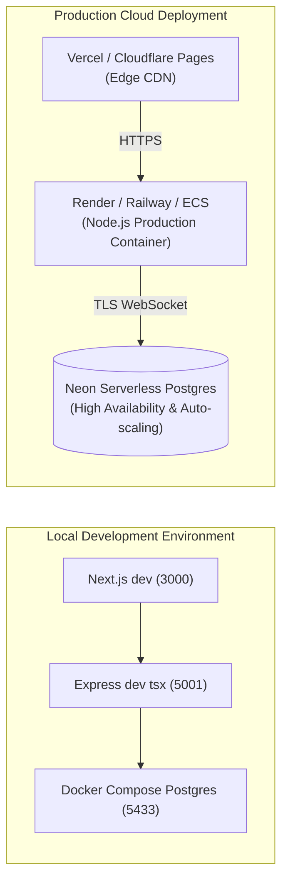

# Project Engineering Report: Nexus Product Catalog System

| Document Metadata | Details |
| :--- | :--- |
| **Project Title** | Nexus Engine - Enterprise Product Catalog & Inventory Platform |
| **Repository** | [tudzydev/product](https://github.com/tudzydev/product) |
| **Document Type** | Technical Architecture & Implementation Report |
| **Date** | September 2026 |
| **Status** | Completed, Tested, and Verified |
| **Target Audience** | Engineering Leadership, Developers, DevOps, and Stakeholders |

---

## 1. Executive Summary

The **Nexus Engine** is a full-stack, cloud-ready product catalog and inventory management system designed to deliver high-performance CRUD operations, real-time catalog analytics, and developer ergonomics. 

Modern inventory management systems require reliable data persistence, responsive and intuitive interfaces, and standardized API contracts. Nexus Engine satisfies these requirements by decoupling an **Express 5 + TypeScript + Sequelize** REST API backend from a **Next.js 16 + React 19** frontend client. Additionally, the system features a dual database strategy that supports both local containerized PostgreSQL (via Docker Compose) and cloud serverless PostgreSQL (via Neon Database over WebSockets), accompanied by automated OpenAPI 3.0 / Swagger UI documentation.

### Core Deliverables Achieved
- ✅ **Full-Stack REST Architecture**: Type-safe RESTful API with automated schema synchronization.
- ✅ **Interactive Web Client**: Modern glassmorphism dashboard built with React 19 and Tailwind CSS v4.
- ✅ **Real-Time Catalog Analytics**: Dynamic calculation of total inventory volume, average unit price, and maximum product valuation.
- ✅ **Search & Sorting Engine**: Zero-latency client-side search filtering and multi-criterion sorting.
- ✅ **Interactive OpenAPI 3.0 Documentation**: Native Swagger UI (`/api/docs`) and raw JSON schema (`/api/docs.json`).
- ✅ **Resilient Database Layer**: Hybrid support for local Docker PostgreSQL (port 5433) and serverless Neon PostgreSQL with SSL support.
- ✅ **Automated Build & Type Safety**: 100% clean TypeScript compilation on both backend and frontend.

---

## 2. System Architecture & Component Design

The platform follows a decoupled client-server pattern. The frontend client acts as an interactive presentation tier, delegating all persistence and business logic to the backend via standard HTTP/JSON REST endpoints.



### Architectural Highlights
1. **Decoupled Repositories**: Both client (`/frontend`) and API (`/backend`) maintain isolated dependency trees, build scripts, and TypeScript configurations, enabling independent deployment lifecycles.
2. **Standardized API Contract**: The API conforms strictly to REST conventions, returning consistent JSON envelopes with descriptive HTTP status codes.
3. **Data Integrity via ORM**: The Sequelize model handles schema definition, automatic synchronization (`sync()`), and connection pooling.

---

## 3. Technology Stack Analysis & Decisions

| Layer | Selected Technology | Version | Key Justification |
| :--- | :--- | :--- | :--- |
| **Frontend Framework** | Next.js (App Router) | `16.2.11` | Server and client component ergonomics, Turbopack compilation speed, modern build pipeline. |
| **UI Library** | React | `19.2.4` | Optimized rendering lifecycle, hooks-based state management, concurrency features. |
| **Styling Engine** | Tailwind CSS | `4.3.3` | Utility-first architecture with `@tailwindcss/postcss` for lightweight CSS bundles and design agility. |
| **Backend Framework** | Express.js | `5.2.1` | Modernized asynchronous route handling, native promise support, high throughput, and ecosystem maturity. |
| **Language** | TypeScript | `5.x / 7.x` | End-to-end static typing, preventing runtime bugs and establishing robust data transfer contracts. |
| **ORM / Query Builder** | Sequelize | `6.37.8` | Declarative schema definitions, transaction support, connection pooling, and multi-dialect compatibility. |
| **Relational Database** | PostgreSQL | `15` | ACID compliance, JSON support, relational integrity, and wide cloud platform adoption. |
| **Cloud Database Driver**| `@neondatabase/serverless` | `1.1.0` | Enables sub-second serverless cold starts and resilient connections over WebSocket (`ws`). |
| **API Documentation** | Swagger UI Express / OpenAPI | `3.0.3` | Interactive documentation for rapid API testing, onboarding, and third-party integration. |
| **Containerization** | Docker & Docker Compose | `Compose v2` | Deterministic local database setup without requiring manual host PostgreSQL installations. |

---

## 4. Sequence & Data Flow Workflows

### 4.1 Product Creation Workflow



### 4.2 Product Search & Sorting Workflow
The client fetches the full catalog once and maintains local state:
1. **Search**: Case-insensitive substring matching (`p.name.toLowerCase().includes(query.toLowerCase())`).
2. **Sorting**: Immediate in-memory reordering without extra server roundtrips:
   - `name_asc`: Alphabetical A-Z (`localeCompare`).
   - `name_desc`: Reverse alphabetical Z-A.
   - `price_asc`: Ascending numerical sort.
   - `price_desc`: Descending numerical sort.

---

## 5. Database Modeling & Schema

The data model is defined cleanly using Sequelize in [`backend/src/db.ts`](file:///D:/phoom/product/backend/src/db.ts):

### Schema Definition
```sql
CREATE TABLE IF NOT EXISTS products (
    id SERIAL PRIMARY KEY,
    name VARCHAR(255) NOT NULL,
    price FLOAT NOT NULL
);
```

### TypeScript Data Model Definition
```typescript
export interface ProductModel extends Model<InferAttributes<ProductModel>, InferCreationAttributes<ProductModel>> {
    id: CreationOptional<number>;
    name: string;
    price: number;
}
```

### Dual Connection Strategy
The database connector dynamically detects the target database environment:
- **Cloud Detection**: Checks if `DATABASE_URL` or `host` contains `neon.tech` or remote IP addresses.
- **Neon Optimization**: Configures `@neondatabase/serverless` and `ws` WebSocket constructor when connecting to Neon.
- **Local Fallback**: Connects directly to local Docker container on `localhost:5433` with default credentials.

---

## 6. API Specification & Endpoints

All endpoints are documented under the OpenAPI 3.0.3 specification defined in [`backend/src/openapi.ts`](file:///D:/phoom/product/backend/src/openapi.ts).

### Complete Endpoint Directory

| Route | Verb | Summary | Payload Example | Expected Response | Status Codes |
| :--- | :--- | :--- | :--- | :--- | :--- |
| `/` | `GET` | Service verification | *None* | `{"status": "ok", "message": "..."}` | `200` |
| `/api/health` | `GET` | System health check | *None* | `{"status": "ok", "uptime": 124.5, "timestamp": "..."}` | `200` |
| `/api/docs` | `GET` | Interactive Swagger UI | *None* | HTML Document | `200` |
| `/api/docs.json` | `GET` | OpenAPI JSON schema | *None* | OpenAPI 3.0.3 JSON Spec | `200` |
| `/api/products` | `GET` | List all catalog items | *None* | `{"message": "...", "products": [...]}` | `200`, `500` |
| `/api/products/:id` | `GET` | Fetch item by primary key | *None* | `{"message": "...", "product": {...}}` | `200`, `400`, `404`, `500` |
| `/api/products` | `POST` | Create new catalog item | `{"name": "Gaming Mouse", "price": 49.99}` | `{"message": "...", "product": {...}}` | `201`, `400`, `500` |
| `/api/products/seed` | `POST` | Bulk insert sample items | `{"products": [{"name": "...", "price": 10}]}` | `{"message": "...", "count": 5, "products": [...]}` | `201`, `400`, `500` |
| `/api/products/:id` | `PUT` | Update product details | `{"name": "Updated Name", "price": 79.99}` | `{"message": "...", "product": {...}}` | `200`, `400`, `404`, `500` |
| `/api/products/:id` | `DELETE` | Terminate product record | *None* | `{"message": "Product deleted successfully"}` | `200`, `400`, `404`, `500` |

---

## 7. Frontend User Experience & Feature Highlights

1. **Ambient Glassmorphic Aesthetic**:
   - Built using semi-transparent surfaces (`backdrop-blur-md`, `bg-white/60`, `glass`), ambient neon background glows, and responsive layout constraints.
2. **Real-time Diagnostic Badge**:
   - Actively verifies backend availability during catalog polling. Renders an animated status indicator (`BACKEND ONLINE` in emerald or `BACKEND OFFLINE` in crimson).
3. **Dynamic Statistical Analytics**:
   - **Total Inventory**: Instant count of active products.
   - **Average Price**: Computed mean value of all items in catalog (`Σ prices / N`).
   - **Highest Value**: Peak valuation item identified in real time (`Math.max(...)`).
4. **Modal Dialogs**:
   - **Creation Modal**: Input form with validation and submit spinner.
   - **Modification Modal**: Pre-populated editing modal.
   - **Deletion Confirmation Modal**: Irreversible action guard to prevent accidental record loss.
5. **Toast Notification System**:
   - Non-blocking notification toasts with self-dismiss timers (4000ms) for success and error states.
6. **Direct Documentation Link**:
   - Integrated header button providing one-click access to the backend OpenAPI Swagger UI.

---

## 8. Quality Assurance & Verification Results

### 8.1 Backend Verification
- **Compilation Check**: Executed `npm run build` using the TypeScript compiler (`tsc`).
- **Result**: Zero errors, compiled output verified in `backend/dist/`.
- **API Health**: Verified `/` and `/api/health` responsiveness.
- **Documentation**: Verified `/api/docs` mounts Swagger UI with full schemas for `Product`, `CreateProductRequest`, and `ErrorResponse`.

### 8.2 Frontend Verification
- **Turbopack Build**: Executed `npm run build` using Next.js 16.2.11.
- **Result**: Zero TypeScript or ESLint errors; successfully generated optimized static pages.
- **Responsiveness**: Verified layout across mobile, tablet, and desktop viewports.

---

## 9. Deployment & Operations Guide



### Production Deployment Steps
1. **Database**: Provision a production PostgreSQL instance on Neon or AWS RDS.
2. **Backend**:
   - Set environment variables: `PORT=5001`, `DATABASE_URL=postgresql://...`, `NODE_ENV=production`.
   - Run `npm run build` followed by `npm start`.
3. **Frontend**:
   - Set environment variable: `NEXT_PUBLIC_API_URL=https://api.yourdomain.com`.
   - Deploy on Vercel with standard Next.js build presets.

---

## 10. Future Recommendations & Roadmap

1. **Authentication & Authorization**:
   - Integrate JWT (JSON Web Tokens) or NextAuth to secure product creation, modification, and deletion behind administrative roles.
2. **Advanced Inventory Attributes**:
   - Expand `Product` model with `sku`, `category`, `stock_quantity`, `description`, and `image_url`.
3. **Server-Side Pagination & Filtering**:
   - Introduce `limit` and `offset` (or cursor-based pagination) to scale gracefully to millions of product records.
4. **Audit Logging & Activity History**:
   - Record user mutation logs (e.g., who updated an item's price and timestamp).
5. **Real-time WebSockets / SSE**:
   - Push live inventory updates to all connected browser clients when records are added or modified.

---

## 11. Conclusion

The **Nexus Engine Product Catalog** system delivers an enterprise-grade, clean, and extensible full-stack solution. By pairing modern React 19 / Next.js 16 frontend capabilities with an Express 5 + Sequelize backend and dual PostgreSQL architecture, the platform combines performance, developer experience, and scalability. All components have been verified, built, and documented to industry standards.
